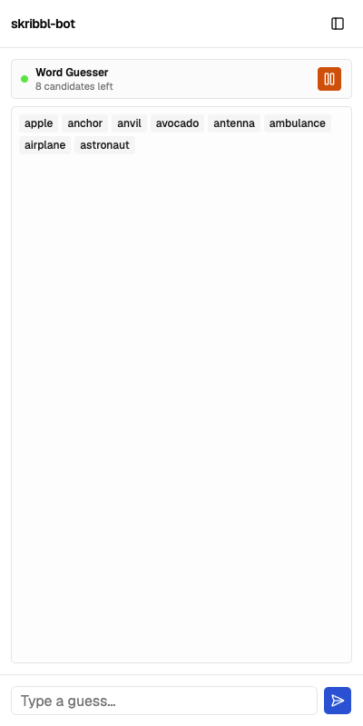
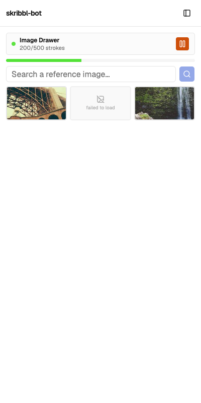

# skribbl-bot

A full-autopilot bot for [skribbl.io](https://skribbl.io), the online drawing-and-guessing
party game. It plays both halves of the game loop end-to-end: guessing the secret word from
chat/hint state, and drawing a fetched reference image onto the canvas when it's your turn —
while a live sidebar shows what it's doing and lets you step in at any point.

<p float="left">
  
  
</p>

<!--
  TODO(showcase): these two are real sidebar-only captures from a UI review pass. The more
  impressive shots — a before/after of a source photo next to what the bot actually drew on
  the skribbl.io canvas, and a screen recording of a draw in progress — need to come from an
  actual play session. Drop them in docs/images/ and link them here when you have them.
-->

## Why it's interesting

- **Perceptual color quantization** — reference images are matched to skribbl's ~20-color
  palette using "redmean" color distance rather than naive RGB distance, so the mapped
  colors look closer to the source than they would with plain Euclidean matching.
- **Pixels to pen strokes** — the quantized image is run-length encoded into horizontal
  strokes, then replayed on the canvas as synthesized pointer events timed like a real drag,
  rather than dabbing pixel by pixel.
- **Cancellation-safe automation** — both the guesser and the drawer run long async
  pipelines (network fetch, image decode, hundreds of timed strokes) against a game that can
  change state at any moment (round ends, user picks a new image). Each run is tagged and
  every await point checks whether it's been superseded, and shared state is mutex-guarded,
  so restarting mid-flight never races itself.
- **Two-view Electron architecture** — the live skribbl.io page and the control panel are
  separate `WebContentsView`s in one window, coordinated over IPC, with a preload script
  doing DOM automation directly against the unmodified game.

## Features

- **Auto word-guessing** — watches the chat/hint state during guessing rounds and submits
  guesses drawn from a bundled word-frequency list, narrowing the candidate list as more
  letters are revealed.
- **Auto image drawing** — on your drawing turn, fetches reference images for the current
  word (via a self-hosted SearXNG instance), lets you pick one, converts it to skribbl's
  fixed color palette, and reproduces it on the canvas as pen strokes.
- **Live sidebar** — docked beside the game, shows what the bot is doing and lets you pause,
  resume, or override it (manual guess, manual image pick, cancel a draw in progress).

Built for a small trusted friend group running it locally — not a public release.

## How it works

skribbl-bot is an Electron desktop app with two views side by side in one window:

- **Game view** — loads `https://skribbl.io` directly, undecorated, no visible automation
  chrome.
- **Sidebar view** — a Vite + React 19 + TypeScript control panel (shadcn/ui-derived
  components, Tailwind CSS v4), styled to echo skribbl.io's own colors and shapes.

The Electron **main process** (`src/electron/`) owns automation logic and network calls
(fetching images, reading the word list, talking to SearXNG). A **preload script**
(`src/electron/preload/`) is injected into the live skribbl.io view and drives the actual
DOM automation:

- [`skribbl-util/wordGuesser.ts`](src/electron/preload/skribbl-util/wordGuesser.ts) —
  builds and narrows a candidate word list against the revealed hint, and submits guesses
  through the chat form on an interval.
- [`skribbl-util/imageDrawer.ts`](src/electron/preload/skribbl-util/imageDrawer.ts) —
  quantizes a fetched image down to skribbl's color palette, converts it into horizontal
  pen strokes, and replays them on the canvas via synthesized pointer events.

Main process and sidebar communicate over Electron IPC (`src/electron/preload/ipc.ts`);
main process and the skribbl.io preload communicate the same way.

## Requirements

- Node.js and npm
- Docker (for the self-hosted [SearXNG](src/searxng/) image search instance used by
  auto-drawing — see `src/searxng/docker-compose.yml`)

## Development

```bash
npm install
npm run dev
```

This runs the Vite dev server for the sidebar and launches the Electron app in parallel.

Other scripts:

```bash
npm run build          # type-check and build the sidebar for production
npm run lint            # run oxlint
npm run dist:mac        # package a macOS build (also dist:win, dist:linux)
```

## TODOS

[ ] expand local word list, if it is a new word
[ ] add url searchbar so users can join an invite
[ ] optimize drawing speed by utilizing different brush sizes / merging strokes
