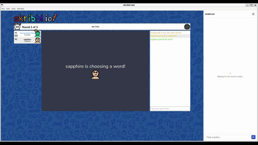
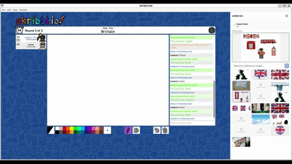

# skribbl-bot

skribbl-bot is a desktop app that automates [skribbl.io](https://skribbl.io), the online
drawing-and-guessing party game. It runs alongside the live game and plays both halves of
the game loop: guessing the secret word from chat/hint state, and drawing a fetched
reference image onto the canvas when it's your turn. A sidebar docked next to the game shows
what it's doing and lets you pause, resume, or override it.

## Demo

<p float="left">
  
  
</p>

## Features

- **Auto word-guessing** — watches the chat/hint state during guessing rounds and submits
  guesses drawn from a bundled word-frequency list, narrowing the candidate list as more
  letters are revealed.
- **Auto image drawing** — on your drawing turn, fetches reference images for the current
  word (via a self-hosted SearXNG instance), lets you pick one, converts it to skribbl's
  fixed color palette, and reproduces it on the canvas as pen strokes.
- **Live sidebar** — docked beside the game, shows what the bot is doing and lets you pause,
  resume, or override it (manual guess, manual image pick, cancel a draw in progress).

Built for a small trusted friend group running it locally — not a public release.

## How it works

skribbl-bot is an Electron desktop app with two views side by side in one window:

- **Game view** — loads `https://skribbl.io` directly, undecorated, no visible automation
  chrome.
- **Sidebar view** — a Vite + React 19 + TypeScript control panel (shadcn/ui-derived
  components, Tailwind CSS v4), styled to echo skribbl.io's own colors and shapes.

The Electron **main process** (`src/electron/`) owns automation logic and network calls
(fetching images, reading the word list, talking to SearXNG). A **preload script**
(`src/electron/preload/`) is injected into the live skribbl.io view and drives the actual
DOM automation:

- [`skribbl-util/wordGuesser.ts`](src/electron/preload/skribbl-util/wordGuesser.ts) —
  builds and narrows a candidate word list against the revealed hint, and submits guesses
  through the chat form on an interval.
- [`skribbl-util/imageDrawer.ts`](src/electron/preload/skribbl-util/imageDrawer.ts) —
  quantizes a fetched image down to skribbl's color palette, converts it into horizontal
  pen strokes, and replays them on the canvas via synthesized pointer events.

Main process and sidebar communicate over Electron IPC (`src/electron/preload/ipc.ts`);
main process and the skribbl.io preload communicate the same way.

## Running it

### Requirements

- Node.js and npm
- Docker, for the self-hosted [SearXNG](src/searxng/) instance auto-drawing uses for image
  search

### 1. Start SearXNG

Auto image drawing searches for reference images through a local SearXNG instance rather
than a third-party API, so it needs to be running first:

```bash
cp src/searxng/.env.example src/searxng/.env   # first time only
./start-searxng.sh
```

This starts SearXNG on `http://localhost:8080`. Leave it running in the background — it's
a one-time setup, not something you restart per session.

### 2. Run the app

```bash
npm install
npm run dev
```

This runs the Vite dev server for the sidebar and launches the Electron app in parallel. Two
views open in one window: the live skribbl.io game, and the sidebar control panel next to it.

### Other scripts

```bash
npm run build          # type-check and build the sidebar for production
npm run lint            # run oxlint
npm run dist:mac        # package a macOS build (also dist:win, dist:linux)
```

## TODO

- [ ] Expand the local word list when a new word comes up
- [ ] Add a URL search bar so users can join a room by invite link
- [ ] Optimize drawing speed with different brush sizes / merged strokes
